cd lecture:
Software Architecture
---
title:
Model of my warehouse management system.
---
author:
Piatti Simone
---

demo

# Getting started

You will
use [Markdown](https://www.markdownguide.org/cheat-sheetplan), [PlantUML](https://plantuml.com/), [architectural decision records](https://github.com/adr/madr),
feature models and connector views to describe a software architecture model about your own project.

This document will grow during the semester as you sketch and refine your software architecture model.

When you are done with each task, please push so we can give you feedback about your work.

We begin by selecting a suitable project domain.

# Ex - Domain Selection

{.instructions

Submit the name and brief description (about 100 words) of your domain using the following vision statement template:

```
For [target customers]
Who [need/opportunity/problem]
The [name your project]
Is  [type of project]
That [major features, core benefits, compelling reason to buy]
Unlike [current reality or competitors]
Our Project [summarize main advantages over status quo, unique selling point]
```

Please indicate if your choice is:

* a project you have worked on in the past (by yourself or with a team)
* a project you are going to work on this semester in another lecture (which one?)
* a new project you plan to build in the future
* some existing open source project you are interested to contribute to

The chosen domain should be unique for each student.

Please be ready to give a 2 minute presentation about it (you can use one slide but it's not necessary)

Hint: to choose a meaningful project look at the rest of the modeling tasks which you are going to perform in the
context of your domain.

}

Project Name: Warehouse Management System

Project Type: a project I have worked on in the past

Vision Statement: This project is for shops with a local warehouse that need to manage the stock of their products. The
warehouse management system is a web application that allows the shop to manage the stock of their products both locally
and remotely. The system allows the shop to add new products, to update the stock of the products, to see the list of
products and to see the details of a product. The system is different from other systems because the user host its own
database and he can use a smartphone or a webcam to read barcodes to update the stock of the products.

Additional Information: Each product can have multiple barcodes depending on how much it contains, for example if a
product has a packet with 10 units with its own barcode it can be registered in the system to make faster operations but
if a product has two different barcodes, since they might changes in time, it can have two barcodes for the single unit.

# Ex - Architectural Decision Records

{.instructions

Software architecture is about making design decisions that will impact the quality of the software you plan to build.

Let's practice how to describe an architectural decision. We will keep using ADRs to document architectural decisions in
the rest of the model.

Use the following template to capture one or more architectural design decisions in the context of your project domain

Pass: 1 ADR

Good: 2 ADR

Exceed: >2 ADR

}

[//]: # (![Architectural Decision Record Template]&#40;./decisions/decision-template.madr&#41;)


# Ex - Quality Attribute Scenario

{.instructions

1. Pick a scenario for a specific quality attribute. Describe it with natural language.

2. Refine the scenario using the following structure:

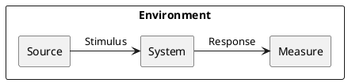

*Stimulus*: condition affecting the system

*Source*: entity generating the stimulus

*Environment*: context under which stimulus occurred (e.g., build, test, deployment, startup, normal operation,
overload, failure, attack, change)

*Response*: observable result of the stimulus

*Measure*: benchmark or target value defining a successful response

Pass: 3 scenarios

Good: >3 scenarios

Exceed: >6 scenarios using challenging qualities

}

## First Scenario

Quality: _Recoverability_

Scenario: In case of power failure, rebooting the system should take up to 30 seconds.

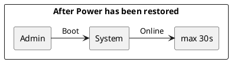

## Second Scenario

Quality: _Performance_

Scenario: In case the user read a barcode, the system should update the stock of the product in less than 1 second.

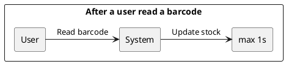

## Third Scenario

Quality: _Scalability_

Scenario: In case a new client try to connect to the system, the system should accept the connection in less than half a
second

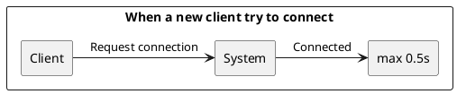

{.feedback

Why Scalability and not Performance?

}

## Fourth Scenario

Quality: _Usability_

Scenario: In case the user want to delete an operation to minimize the impact of errors, the system should delete the
operation in less than 2 seconds.

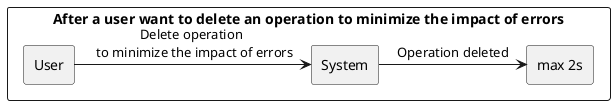

{.feedback

Why Usability and not Performance?

Undo is a great usability feature to recover from mistakes. The 2 second constraint however makes the scenario also
relevant for performance.

}

## Fifth Scenario

Quality: _Performance_

Scenario: In case the user want to update the information of a product, the system should update the information in less
than 2 seconds.

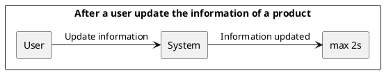

{.feedback

Overlap between environment and source/stimulus.

Also, performance was already modeled before in the first scenario.

}

## Sixth Scenario

Quality: _Testability_

Scenario: Each code unit should have at least 80% of code coverage during the development phase.

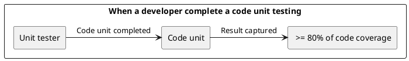

{.feedback

Environment inconsistent with the scenario text (copy paste?)

Stimulus could be clarified with "test" or "run test" or "check"

}

## Seventh Scenario

Quality: _Modifiability_

Scenario: In case the developer, at design time, want to change the UI, the developer should be able to do it in less
than 3 hours with no side effect.

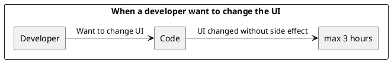

# Ex - Quality Attribute Tradeoff

{.instructions

Pick a free combination of two qualities on
the [map](https://usi365.sharepoint.com/:x:/s/MSDE2023-SoftwareArchitecture/EbK1lRTVOUZJhQoz0XdUBwIBd5vd5yQblOaOwYze4ovbuA?e=6aexs6)
and write your name to claim it.

Then write a short text giving an example for the tradeoff in this assignment.

Pass: 1 unique trade-off

Good: 2 trade-offs

Exceed: >2 trade-offs

}

## Portability vs. Performance (Example)

Developing an app natively for each OS is expensive and time consuming, but it benefits from a good performance.
Choosing a cross-platform environment on the other hand simplify the development process, making it faster and cheaper,
but it might suffer in performance.

## Simplicity vs. Compatibility

Developing a system that is simple to use and understand is a good thing as developing an system that can be integrated
with various other products.
But when we want to make our system simple to use and understand but also compatible with various other products the
chances that the product becomes complex to use and the architecture of the product becomes complex are very high.
That also makes the system even more difficult to develop and maintain.

## Performance vs. Modifiability

To develop a system that is fast and efficient we probably need to use some code tricks, optimizations and rely on
execution side effect to make the system faster.
This approach can make the code more complex and difficult to understand and even small changes can have a big impact on
the system performance and make the system slower.
On the other hand, if we want to make the system easy to understand and modify we probably need to reduce the use of
code tricks and optimizations and don't rely on execution side effects.

## Usability vs. Portability

Developing a system that is easy to use and understand might rely on some specific features of a specific OS or
hardware, but it will increase the modification need to make the system runs on different OSs with minimal modification.
Different platforms and OSs impose different constraints and offer variable usability characteristics.

# Ex - Feature Modeling

{.instructions

In the context of your chosen project domain, describe your domain using a feature model.

The feature model should be correctly visualized using the following template:


If possible, make use of all modeling constructs.

Pass: Include at least 4 non-trivial features

Good: Include at least 6 non-trivial features, which are all implemented by your project

Exceed: Include more than 8 non-trivial features, indicate which are found in your project and which belong to one
competitor

}


# Ex - Context Diagram

{.instructions

Prepare a context diagram to define the design boundary for your project.

Here is a PlantUML/C4 example to get started.


Make sure to include all possible user personas and external dependencies you may need.

Pass: 1 User and 1 Dependency

Good: >1 User and >1 Dependency

Exceed: >1 User and >1 Dependency, with both incoming and outgoing dependencies

}


# Ex - Component Model: Top-Down

{.instructions

Within the context of your project domain, represent a model of your modular software architecture decomposed into
components.

The number of components in your logical view should be between 6 and 9:

- At least one component should be further decomposed into sub components
- At least one component should already exist. You should plan how to reuse it, by locating it in some software
  repository and including in your model the exact link to its specification and its price.
- At least one component should be stateful.

The logical view should represent provide/require dependencies that are consistent with the interactions represented in
the process view.

The process view should illustrate how the proposed decomposition is used to satisfy the main use case given by your
domain model.

You can add additional process views showing how other use cases can be satisfied by the same set of components.

This assignment will focus on modularity-related decisions, we will worry about deployment and the container view later.

Here is a PlantUML example logical view and process view.

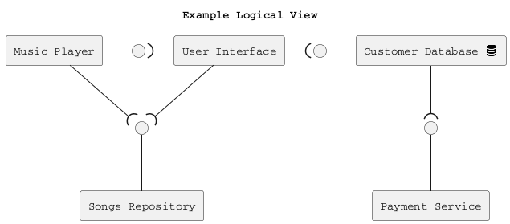

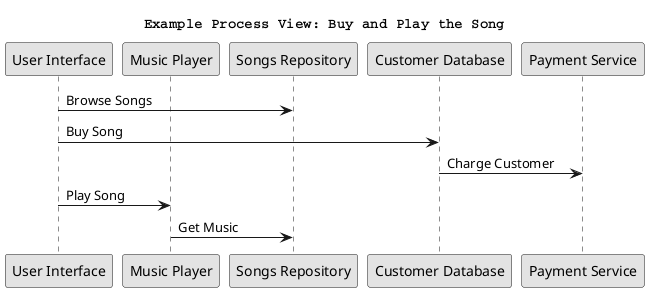

Hint: How to connect sub-components to other external components? Use this pattern.

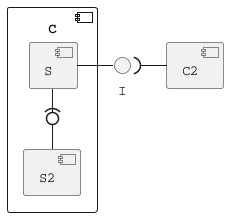

Pass: 6 components (1 decomposed), 1 use case/process view

Good: 6 components (1 decomposed), 2 use case/process view

Exceed: >6 components (>1 decomposed) and >2 use case/process view

}

## Logical View


## Process Views

### Use Case #1:

A user use the phone camera to scan a barcode and load/unload the corresponding product.


### Use Case #2:

A user use the desktop web application to scan a barcode and see the corresponding product information.


### Use Case #3:

A user use the desktop web application to update the product information from the name of the product.


# Ex - Component Model: Bottom-Up

{.instructions

Within the context of your project domain, represent a model of your modular software architecture decomposed into
components.

To design this model you should attempt to buy and reuse as many components as possible.

In addition to the logical and process views, you should give a precise list to all sources and prices of the components
you have selected to be reused.

Write an ADR to document your component selection process (indicating which alternatives were considered).

Pass: Existing design with at least 1 reused components (1 Logical View, 1 Process View)

Good: Existing design with at least 3 reused components (1 Logical View, 1 Process View, 1 ADR)

Exceed: Redesign based on >3 reused components (1 Logical View, >1 Process View, >1 ADR)

}

## Logical View


## Process View

### Use Case:

Two user are connected to the system one using the desktop web interface and the other using the mobile application.
The user using the desktop web application use use a barcode to load/unload the corresponding product.
The user using the mobile application need to see the list of the done operations updated automatically when a new
operation is done.


### ADR


# Ex - Interface/API Specification

{.instructions

In this iteration, we will detail your previous model to specify the provided interface of all components based on their
interactions found in your existing process views.

1. choose whether to use the top down or bottom up model. If you specify the interfaces of the bottom up model, your
   interface descriptions should match what the components you reuse already offer.

2. decide which interface elements are operations, properties, or events.

Get started with one of these PlantUML templates, or you can come up with your own notation to describe the interfaces,
as long as it includes all the necessary details.

The first template describes separately the provided/required interfaces of each component.


The second template annotates the logical view with the interface descriptions: less redundant, but needs the logical
dependencies to be modeled to show which are the required interfaces.


Pass: define interfaces of all outer-level components

Good: Define interfaces of all outer-level components. Does your architecture publish a Web API? If not, extend it so
that it does.

Exceed: Also, document the Web API using the OpenAPI language. You can use
the [OpenAPI-to-Tree](http://api-ace.inf.usi.ch/openapi-to-tree/) tool to visualize the structure of your OpenAPI
description.

}

\
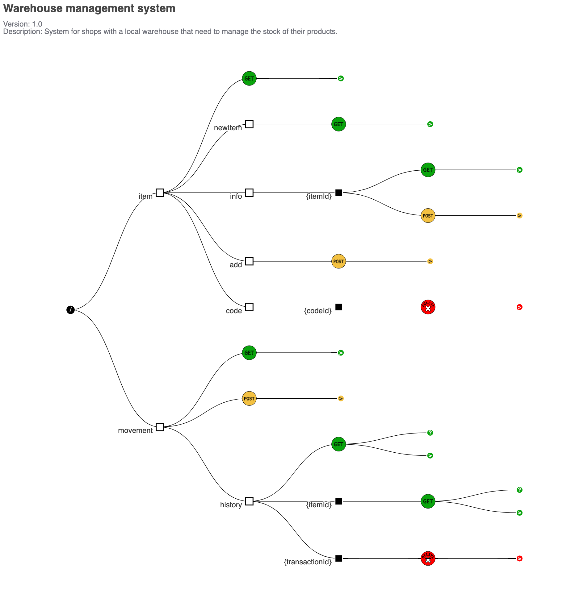

# Ex - Connector View

{.instructions

Extend your existing models introducing the connector view

For every pair of connected components (logical view), pick the most suitable connector. Existing components can play
the role of connector, or new connectors may need to be introduced.


Make sure that the interactions shown in the process views reflect the primitives of the selected connector

Pass: model existing connectors based on previous model decisions

Good: model existing connectors based on previous model decisions, write an ADR about the choice of one connector

Exceed: introduce a new type of connector and update your existing process view
(sequence diagram) to show the connector primitives in action

}


# Ex - Adapters and Coupling

{.instructions

1. Highlight the connectors (or components) in your existing bottom-up design playing the role of adapter. (We suggest
   to use the bottom-up design since when dealing with externally sourced components, their interfaces can be a source
   of mismatches).
2. Which kind of mismatch** are they solving?
3. Introduce a wrapper in your architecture to hide one of the previously highlighted adapters
4. Where would standard interfaces play a role in your architecture? Which standards could be relevant in your domain?
5. Explain how one or more pairs of components are coupled according to different coupling facets
6. Provide more details on how each adapter solves the mismatches identified using pseudo-code or the actual code
7. How can you improve your architectural model to minimize coupling between components? (Include a revised
   logical/connector view with your solution)

Pass: 1-5 (with one adapter)

Good: 1-6 (with at least two adapters)

Exceed: 1-7 (with at least two adapters)

** If you do not find any mismatch in your existing design we suggest to introduce one artificially.

## Hints

* (1) Should we find cases where two components cannot communicate (and are doing it wrongly) and highlight they would
  need an adapter?, or cases where we have already a "component playing the role of adapter in the view" and highlight
  only the adapter?

  *Both are fine. We assumed that if you draw a dependency (or a connector) the interfaces match, but if you detect that
  the components that should communicate cannot communicate then of course introduce an adapter to solve the mismatch*

* (2) Please show the details about the two interfaces which do not match (e.g., names of parameters, object structures)
  so that it becomes clear why an adapter is needed and what the adapter should do to bridge the mismatch

* (5-6) These questions are about the implications on coupling based on the decisions you documented in the connector
  view.
  Whenever you have a connector you couple together the components and different connectors will have different forms of
  coupling

  For example, if you use calls everywhere, do you really need them everywhere? is there some pair of components where
  you could use a message queue instead?

  Regarding the coupling facets mentioned in question 5. You do not have to answer all questions related to "
  discovery", "session", "binding", "interaction", "timing", "interface" and "platform" (p.441, Coupling Facets). Just
  the ones that you think are relevant for your design and by answering them you can get ideas on how to do question 6.

}


## Solved mismatches

##### **Operation granularity**

The three databases connectors play the role of adapters between the "operation handler" and the three databases because
the "operation handler" can not talk directly to the MongoDB databases.
This adapters is also necessary because the "operation handler" need to do some complicated operation on the databases
that imply to make a lot of call to the databases and it may cause some problems to the final users.


## Standard interfaces

The standard interfaces that are used in this system are:

- HTTP/HTTPS for the communication between the _two web interfaces_ and the _express server_
- SQL for the communication between the databases wrapper and the three databases
- JSON object to communicate between the express server and the operation handler and also between the operation handler
  and the databases wrapper

## Coupling

In this part we will analyze the coupling n between the two web interfaces (_mobile web interface_ and _desktop web
interface_ ) and the _express server_.
The components doesn't share a state since in each request done to the _express server_ all the data needed are passed.
The components are coupled by the **interaction** and **timing** facet because they need to communicate with each other
to exchange the data for the operation that the user need to do and they need to be available at the same time.
Since the system is a web based application the Interface/API of the express server and the platform on which it run can
changed without affecting the two web interfaces.

# Ex - Physical and Deployment Views

{.instructions

a. Extend your architectural model with the following viewpoints:

1. Physical or Container View

2. Deployment View

Your model should be non-trivial: include more than one physical device/virtual container (or both). Be ready to discuss
which connectors are found at the device/container boundaries.

b. Write an ADR about which deployment strategy you plan to adopt. The alternatives to be considered are: big bang,
blue/green, shadow, pilot, gradual phase-in, canary, A/B testing.

c. (Optional) Prepare a demo of a basic continuous integration and delivery pipeline for your architectural
documentation so that you can obtain a single, integrated PDF with all the viewpoints you have modeled so far.

For example:

- configure a GitHub webhook to be called whenever you push changes to your documentation
- setup a GitHub action (or similar) to build and publish your documentation on a website

Pass: 1 physical view, 1 deployment view, 1 ADR (b.)

Good: >1 physical view, >1 deployment view, 1 ADR (b.)

Exceed: 1 physical view, 1 deployment view, 1 ADR (b.) + 1 demo (c.)

}


# Ex - Availability and Services

{.instructions

The goal of this week is to plan how to deliver your software as a service with high availability.

1. If necessary, change your deployment design so that your software is hosted on a server (which could be running as a
   Cloud VM). Your SaaS architecture should show how your SaaS can be remotely accessed from a client such as a Web
   browser, or a mobile app
2. Sketch your software as a service pricing model (optional)
3. How would you define the availability requirements in your project domain? For example, what would be your
   expectation for the duration of planned/unplanned downtimes or the longest response time tolerated by your clients?
4. Which strategy do you adopt to monitor your service's availability? Extend your architecture with a watchdog or a
   heartbeat monitor and motivate your choice with an ADR.
5. What happens when a stateless component goes down? model a sequence diagram to show what needs to happen to recover
   one of your critical stateless components
6. How do you plan to recover stateful components? write an ADR about your choice of replication strategy and whether
   you prefer consistency vs. availability. Also, consider whether event sourcing would help in your context.
7. How do you plan to avoid cascading failures? Be ready to discuss how the connectors (modeled in your connector view)
   impact the reliability of your architecture.
8. How did you mitigate the impact of your external dependencies being not available? (if applicable)

Pass: 1, 3, 4, one of:  5, 6, 7, 8

Good: 1, 2, 3, 4, two of:  5, 6, 7, 8

Exceed: 1, 2, 3, 4, 5, 6, 7, 8

}

## 1


## 2

The pricing model I have decide to use is based on the amount of products that user wants to store in the remote
databases and also the number of clients he wants to use simultaneously:

- Base plan : 100 products, 5 simultaneous clients == 0.99 CHF/month
- Pro plan : 500 products, 20 simultaneous clients == 2.99 CHF/month
- Full plan : 1000 products, 100 simultaneous clients == 4.99 CHF/month

I have also think a plan for big business that wil change the price based on the number of connected clients and number
of product stored

- Business plan: 9.99 fixed + 0.19 * new client + 0.09 * product for each month

## 3

The system must be always available during working time so the planned downtimes must be during the night time for less
than 3 hours and the longest response time tolerated by your clients, during day time, must be less than 1 hour.

## 4


## 5

Operation handler goes down


## 6

## 7

Since I have opted to use a watchdog I can use it to prevent overloaded servers using the response time for some types
of request and so limit the probability of cascading failures.
Other way to limit cascading failure is to create a new operation handler dedicated for users that will have a high
number of concurrent clients since they can generate a high number of request and so they will be divided on the
different handler

## 8

The only external dependency of this system is "html5-qrcode" which will always be available as it runs locally in the
user's mobile phone.

# Ex - Flexibility

{.instructions

Only dead software stops changing. You just received a message from your customer, they have an idea. Is your
architecture ready for it?

1. Pick a new use case scenario. Precisely, what exactly do you need to change of your existing architecture so that it
   can be supported? Model the updated logical/process/deployment views.

2. Pick another use case scenario so that it can be supported without any major architectural change (i.e., while you
   cannot add new components, it is possible to extend the interface of existing ones or introduce new dependencies).
   Illustrate with a process view, how your previous design can satisfy the new requirement.

3. Change impact. One of your externally sourced component/Web service API has announced it will introduce a breaking
   change. What is the impact of such change? How can you control and limit the impact of such change? Update your
   logical view

4. Open up your architecture so that it can be extended with plugins by its end-users. Where would be a good extension
   point? Update your logical view and give at least one example of what a plugin would actually do.

5. Assuming you have a centralized deployment with all stateful components storing their state in the same database,
   propose a strategy to split the monolith into at least two different microservices. Model the new logical/deployment
   view as well as the interfaces of each microservice you introduce.

Pass: 1, one out of 2-5.

Good: 1, two out of 2-5.

Exceed: 1-5.

}
